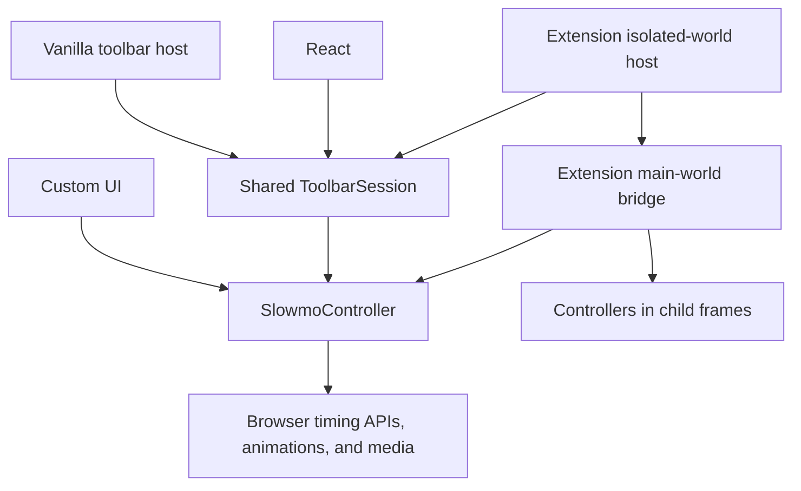

# Slowmo Toolbar Architecture and Launch Plan
Status: Proposed for review  
Date: 2026-07-27  
Target: the current toolbar redesign PR, followed by coordinated npm, website, and Chrome Web Store releases
## Outcome
Slowmo should be one product with three delivery modes:

| Mode | Customer | What they install | UI  |
| --- | --- | --- | --- |
| Headless | Developers building their own controls or combining Slowmo with other dev tools | `slowmo` | Their own |
| Embedded toolbar | Product teams that want Slowmo available inside their app | `slowmo/toolbar` or `slowmo/react` | The shared Slowmo toolbar |
| Chrome extension | People who want Slowmo on arbitrary sites without changing source code | Chrome extension | The same shared Slowmo toolbar |

The timing runtime and the toolbar must each have one implementation. React should adapt the toolbar, not reimplement it. The extension should inject and host the same toolbar, not carry a separate toolbar implementation.

The critical lifecycle invariant is:

> If Slowmo's toolbar is visible, its timing runtime is active. If the toolbar is closed, Slowmo removes its timing effects from that document. A later trigger starts a fresh session at 1×.

A lightweight trigger listener may remain in a React host, and the extension's background service worker remains installed. Neither is allowed to patch page timing while the toolbar is absent.
## What the Repository Does Today
The toolbar redesign is visually strong, and the current React export already delegates to the framework-agnostic DOM toolbar. The weak point is lifecycle ownership:

| Current behavior | Consequence |
| --- | --- |
| Importing `src/index.ts` immediately installs timing patches | Import has a page-wide side effect before the caller asks for one |
| The engine has `install()` but no public inverse | Closing or unmounting the toolbar cannot restore native timing |
| The animation polling loop never receives or cancels its request ID | A hidden Slowmo instance continues to inspect page animations |
| `setupDial()`/`shutdownDial()` own only the toolbar element | UI lifetime and timing-runtime lifetime can diverge |
| The toolbar persists its selected speed | Reopening can silently restore a non-1× speed |
| The manifest statically injects `content.js` into every matching document and frame | Extension code and timing hooks load before the user triggers the extension |
| The extension action dispatches an event but does not inject the bundle | An existing tab may require a reload after installing or reloading the extension |
| The extension E2E tests that exercise injection and synchronization are skipped | The most important lifecycle has no automated release gate |
| README, specification, extension checklist, and store copy describe different activation/reload behavior | Users and maintainers cannot tell which contract is intentional |
## Requirements
| ID  | Requirement | Priority |
| --- | --- | --- |
| R0  | A headless consumer can control time without importing toolbar or React code. | Must |
| R1  | An app can add the complete toolbar with one vanilla or React integration. | Must |
| R2  | Embedded and extension toolbars share visuals, presets, dragging, docking, orientation, close behavior, and accessibility. | Must |
| R3  | The timing runtime has explicit, idempotent activation and teardown. | Must |
| R4  | Importing a module does not patch browser globals until the caller activates or changes speed. | Must |
| R5  | Closing the visible toolbar resets to 1×, restores owned timing hooks, stops polling, restores controlled animation/media state where possible, and removes the UI. | Must |
| R6  | Reopening starts at 1× while remembering placement and orientation. Speed and closed/open state do not persist by default. | Must |
| R7  | Default placement, persistence, shortcut, initial open state, and mounting target are configurable for embedded consumers. | Must |
| R8  | Placement supports semantic defaults such as `bottom-right`, `bottom-center`, `bottom-left`, and an element-relative starting anchor that becomes free-floating after the first drag. | Must |
| R9  | The extension is inactive on a document until its action or shortcut is triggered, including after navigation or reload. | Must |
| R10 | The extension action works on tabs that were already open when the extension was installed or reloaded. | Must |
| R11 | Extension activation is scoped to the active tab/document and synchronized through that tab's eligible frame tree. | Must |
| R12 | A second activation does not create a duplicate toolbar or double-patch globals. | Must |
| R13 | The extension and an embedded copy of Slowmo do not overwrite one another's captured native functions or tear down effects they do not own. | Must |
| R14 | Existing `slowmo(speed)`, `slowmo/dial`, and `<Slowmo />` integrations have a documented migration path and remain compatible where practical. | Must |
| R15 | Lifecycle, toolbar behavior, React behavior, and extension behavior have automated release-gating tests. | Must |
| R16 | The website demonstrates headless controls and the shared toolbar using local, reliable assets. | Must |
| R17 | Documentation clearly separates headless, embedded-toolbar, and extension use cases and gives exact test and release instructions. | Must |
| R18 | Release artifacts can be inspected locally before npm or Chrome Web Store publication. | Must |
| R19 | Additional framework adapters and cloud-hosted sandboxes can be added without changing the runtime or toolbar core. | Should |
| R20 | Publishing can later move to CI with npm provenance and automated Chrome upload. | Could |
## Shapes Considered
### Shape A — Repair the Existing Singletons
Keep the current module-level engine and toolbar singleton, add an `uninstall()`, thread more options through `setupDial()`, and change the extension to inject on action.

This is the smallest code change, but the engine, toolbar host, and extension still implicitly own global state. React Strict Mode, multiple bundled copies, extension/embedded coexistence, and custom toolbar clients remain difficult to reason about.
### Shape B — Reversible Runtime + Shared Toolbar + Thin Hosts
Create a deep, framework-agnostic timing controller with explicit ownership and teardown. Build one framework-agnostic toolbar session around it. Adapt that session for vanilla JS, React, the demo, and the extension.

This is the recommended shape. It creates two durable product layers:

1. A reversible headless timing runtime.
  
2. A configurable toolbar session that owns a runtime lease while visible.
  

React remains optional. The extension bundles the vanilla toolbar and runtime, so React is never shipped to arbitrary pages.
### Shape C — React-First Toolbar Everywhere
Make React the canonical toolbar implementation and bundle React into the extension. Keep a separate headless engine for custom UIs.

This would make the React API pleasant, but it would add a runtime dependency to the extension and vanilla consumers, complicate arbitrary-page mounting, and make the design system—not the timing runtime—the deepest module.
## Fit Check
| Req | A: repaired singletons | B: runtime + shared toolbar | C: React-first |
| --- | ---: | ---: | ---: |
| R0 Headless without UI | ✅   | ✅   | ✅   |
| R1 One-step embedded toolbar | ✅   | ✅   | ✅   |
| R2 One toolbar implementation | ✅   | ✅   | ✅   |
| R3 Explicit idempotent teardown | ⚠️  | ✅   | ⚠️  |
| R4 Side-effect-free imports | ❌   | ✅   | ✅   |
| R5 Close fully deactivates owned effects | ⚠️  | ✅   | ⚠️  |
| R6 Placement persists; speed does not | ✅   | ✅   | ✅   |
| R7 Configurable embedded host | ⚠️  | ✅   | ✅   |
| R8 Semantic and element-relative start | ⚠️  | ✅   | ✅   |
| R9 Extension action-first lifecycle | ✅   | ✅   | ✅   |
| R10 Works on already-open tabs | ✅   | ✅   | ✅   |
| R11 Per-tab/document frame sync | ✅   | ✅   | ✅   |
| R12 No duplicate activation | ⚠️  | ✅   | ⚠️  |
| R13 Extension/embedded coexistence | ❌   | ✅   | ❌   |
| R14 Compatibility/migration | ✅   | ✅   | ⚠️  |
| R15 Release-gating tests | ✅   | ✅   | ✅   |
| R16 Reliable live examples | ✅   | ✅   | ✅   |
| R17 Clear documentation/releases | ✅   | ✅   | ✅   |
| R18 Inspectable artifacts | ✅   | ✅   | ✅   |
| R19 Future adapters | ⚠️  | ✅   | ⚠️  |
| R20 Future publish automation | ✅   | ✅   | ✅   |

Shape B is the only shape that satisfies the lifecycle and composition requirements without making React or the extension the owner of product behavior.
## Recommended Architecture

### B1. Headless Timing Runtime
Add a public controller API and make imports side-effect free:

```ts
import { createSlowmoController } from "slowmo";

const controller = createSlowmoController();

controller.activate();       // captures and patches this realm
controller.setSpeed(0.5);
controller.pause();
controller.play();
controller.reset();
controller.getSnapshot();    // { status, speed, paused }
controller.subscribe(fn);
controller.destroy();        // restores what this controller owns
```

Keep the convenient API:

```ts
import slowmo from "slowmo";

slowmo(0.5);       // lazily activates a default controller
slowmo.reset();
slowmo.destroy();  // new explicit cleanup
```

The controller should own:

- Captured native function identities.
  
- Virtual clocks.
  
- The polling request ID.
  
- Tracked Web Animations and media state.
  
- Any timers created through its patched APIs that need cancellation or rescheduling.
  
- A state subscription API for any UI.
  

The controller must not own:

- Toolbar position, docking, shortcuts, or visual state.
  
- React lifecycle.
  
- Chrome tabs, frame routing, or extension storage.
  

The page realm should expose a versioned runtime registry using `Symbol.for(...)` or an equivalent stable global protocol. Multiple Slowmo hosts acquire and release ownership instead of capturing each other's wrappers as “native” functions. The last owner tears the runtime down. This replaces the current extension-takeover special case.

Teardown can restore future timing behavior and controlled runtime objects. It cannot reverse a callback that already fired, an animation that already finished, or a media seek that already occurred. That boundary belongs in the API documentation and tests.
### B2. Shared Toolbar Session
Rename the product concept from “dial” to “toolbar” while retaining `slowmo/dial` aliases for compatibility.

```ts
import { createSlowmoToolbar } from "slowmo/toolbar";

const toolbar = createSlowmoToolbar({
  defaultPlacement: "bottom-center",
  anchor: document.querySelector("#try-it"),
  shortcut: "Mod+Shift+S",
  persist: {
    placement: true,
    orientation: true,
    speed: false,
    open: false,
  },
});

toolbar.open();
toolbar.close();
toolbar.toggle();
toolbar.destroy();
```

`ToolbarSession` is the product behavior boundary:

| State | Toolbar DOM | Timing runtime | Trigger listener |
| --- | --- | --- | --- |
| Dormant | Absent | Inactive | Present when the host supports reopening |
| Opening | Mounting | Activating at 1× | Present |
| Active | Visible | Active | Present |
| Closing | Leaving | Resetting, then tearing down | Present |
| Destroyed | Absent | Inactive | Removed |

`close()` means “end this Slowmo session,” not merely “hide the element.” `destroy()` additionally removes the embedded host's shortcut listener and other host resources.

The toolbar core should receive initial state and emit state changes. It should not call `localStorage` directly. Hosts provide persistence:

- Embedded default: placement/orientation in origin-scoped `localStorage`.
  
- Extension default: placement/orientation in extension-owned `chrome.storage.local`, shared across sites.
  
- Tests/custom hosts: in-memory or disabled adapter.
  

Speed always starts at 1× unless a consumer explicitly opts into another initial speed. Visibility does not persist by default.

Placement should be semantic first:

```ts
type ToolbarPlacement =
  | "top-left" | "top-center" | "top-right"
  | "left" | "center" | "right"
  | "bottom-left" | "bottom-center" | "bottom-right"
  | { x: number; y: number }
  | { anchor: Element; side?: "top" | "right" | "bottom" | "left"; gap?: number };
```

An anchored toolbar follows its anchor until the first deliberate drag. After that it becomes viewport-relative and persists the dragged placement. This covers the homepage's “centered below Try It” behavior without adding demo-only positioning code.
### B3. Vanilla and React Adapters
The vanilla export is the canonical host. React delegates to it:

```tsx
import { SlowmoToolbar } from "slowmo/react";

function DebugTools() {
  return (
    <SlowmoToolbar
      defaultPlacement="bottom-left"
      shortcut="Mod+Shift+S"
      defaultOpen={false}
    />
  );
}
```

The React adapter should:

- Create one host after mount.
  
- Update supported options without remounting where practical.
  
- Survive React Strict Mode's mount/cleanup/remount cycle.
  
- Close the session and remove its shortcut listener on unmount.
  
- Render no duplicate visual implementation.
  

Retain `<Slowmo />` as a deprecated alias for at least one minor release.
### B4. Extension Host
The extension should not declare a static `content_scripts` entry. The background service worker should use one `activateCurrentTab()` function for both the toolbar icon and the `_execute_action` keyboard command.

Activation:

1. User clicks the extension icon or uses its assigned shortcut.
  
2. Background injects the main-world runtime bridge into all eligible frames of the active tab using `chrome.scripting.executeScript({ files, target: { tabId, allFrames: true }, world: "MAIN" })`.
  
3. Background injects the toolbar host into the top frame's isolated world.
  
4. The top-frame toolbar opens at 1×, applies commands to its main-world
   bridge, and sends the same primitive commands to the background worker.

5. The background worker fans commands out through Chrome's scripting API so
   same-origin, cross-origin, nested, and dynamically created frames share the
   active speed.
  

Close:

1. Toolbar emits a deactivate command.
  
2. Every frame resets and releases the extension's runtime ownership.
  
3. Main-world listeners and polling stop.
  
4. Toolbar DOM and isolated-world listeners are removed.
  
5. Placement/orientation are stored in extension storage.
  

Navigation or reload creates a new inactive document. The user triggers Slowmo again when wanted. Different tabs are independent. This matches the user's mental model and avoids silently affecting every visited page.

Chrome extension keyboard shortcuts are registered through the manifest `commands` API. `_execute_action` can invoke the same action handler as the toolbar icon. Users can remap it at `chrome://extensions/shortcuts`. `Command+Shift+D` is already Chrome's “Bookmark All Tabs” shortcut on macOS and should not be the suggested default; an extension cannot reliably override browser/OS-reserved shortcuts. The embedded React/vanilla shortcut is separate browser-page code, but it should call the same `toggle()` lifecycle command.

This design can also drop broad persistent `host_permissions` if `activeTab` plus `scripting` covers the intended action-triggered behavior. Confirm cross-origin iframe behavior in the extension E2E suite before removing the host permission.
### B5. Public Exports
Proposed package surface:

| Export | Purpose |
| --- | --- |
| `slowmo` | Default headless singleton convenience API |
| `createSlowmoController` | Explicit headless lifecycle and custom UI integration |
| `slowmo/toolbar` | Framework-agnostic toolbar host |
| `slowmo/react` | Thin React adapter |
| `slowmo/dial` | Deprecated compatibility alias to toolbar host |
| `slowmo/recreate` | Existing unrelated export; unchanged |

React must remain an optional peer dependency and must not enter the core or extension bundles.
## Tests That Gate Release
### Runtime unit and browser tests
- Import does not change `requestAnimationFrame`, `performance.now`, `Date.now`, `setTimeout`, or `setInterval`.
  
- First activation captures native identities exactly once.
  
- Repeated activation is idempotent.
  
- Speed, pause, play, reset, and subscription snapshots are correct.
  
- Destroy restores exact native function identities.
  
- Destroy stops the polling loop.
  
- Destroy restores developer playback rates for live Web Animations and media.
  
- Destroy resumes only media/animations paused by Slowmo.
  
- Activate → destroy → activate works repeatedly.
  
- Two owners cannot double-patch or tear down one another's active lease.
  
- Excluded elements and the Slowmo toolbar remain at wall-clock speed.
  
- Pending timer behavior during speed changes and teardown matches the documented contract.
  
### Toolbar tests
- Every preset, 1× magnetism, overscroll, pause/play, and double-click reset.
  
- Horizontal and vertical rendering.
  
- Drag ring, divider dragging, docking, scrollbars, viewport resize, and top-layer behavior.
  
- Every semantic default placement.
  
- Element-relative anchor before drag and viewport-relative persistence after drag.
  
- Placement/orientation persistence and default non-persistence of speed/open state.
  
- Close calls full session deactivation.
  
- Shortcut opens/closes without duplicate listeners.
  
- Trusted Types/CSP-safe icon construction.
  
- Keyboard access, focus labels, reduced motion, and light/dark styles.
  
### React adapter tests
- Mount, close, shortcut reopen, prop defaults, and unmount.
  
- React Strict Mode does not leave duplicate toolbars, patches, or listeners.
  
- Two component instances follow the documented single-realm ownership rule.
  
### Extension E2E tests
- Before trigger: no toolbar, no Slowmo runtime marker, native function identities unchanged.
  
- Icon/command trigger on an already-open tab injects and shows one toolbar.
  
- Activation begins at 1×.
  
- Same-origin, cross-origin, nested, and dynamically created frames synchronize.
  
- Close removes the toolbar and restores timing in every injected frame.
  
- Re-trigger opens a clean 1× session.
  
- Reload/navigation is inactive.
  
- Two tabs remain independent.
  
- Restricted pages fail quietly and give useful extension feedback where Chrome permits it.
  
- A strict Trusted Types page still renders the toolbar.
  

The currently skipped extension behavior tests should be replaced by a real release gate. A small manual matrix remains useful for visual checks, but it should not be the only proof of lifecycle correctness.
## Examples and Documentation
The website should lead with three explicit choices:

1. “Control it yourself” — a small custom headless UI using `createSlowmoController`.
  
2. “Add the toolbar to your app” — the shared toolbar, anchored below “Try It” until dragged.
  
3. “Use it anywhere” — Chrome extension install and shortcut instructions.
  

Repository examples:

| Example | Purpose |
| --- | --- |
| `examples/headless-vanilla` | Custom controls with no Slowmo toolbar |
| `examples/toolbar-vanilla` | Configured placement, persistence, shortcut, and close/reopen |
| `examples/toolbar-react` | Drop-in React component and debug-menu integration |
| `demo/` | Live product site using the same local video and animation fixtures |
| `tests/fixtures/extension-*` | Extension lifecycle and iframe test pages |

Use source-controlled examples rather than downloadable generated snippets. Publish the site examples live and link each one to its directory so users can clone or copy it. After the npm release, smoke-test the examples against the packed tarball rather than workspace aliases.

Documentation set:

- `README.md`: choose-your-mode quick start and small API overview.
  
- `docs/headless.md`: controller lifecycle, exclusions, limitations, and custom UI.
  
- `docs/toolbar.md`: vanilla/React APIs, options, placement, persistence, shortcuts.
  
- `docs/chrome-extension.md`: activation model, per-tab behavior, iframe behavior, shortcuts, privacy.
  
- `CONTRIBUTING.md`: current dev commands and extension test workflow.
  
- `docs/RELEASING.md`: separate npm, website, and extension checklists.
  
- `specs/SPEC.md`: normative behavior, kept consistent with tests.
  
## Scope for the Current Toolbar PR
This PR should not ship the new toolbar while preserving the known lifecycle mismatch. Include:

1. Reversible controller lifecycle and side-effect-free import.
  
2. Shared `ToolbarSession` with configurable placement/persistence/shortcut.
  
3. Vanilla and React adapters with legacy aliases.
  
4. Action-triggered extension injection, full-frame teardown, and `_execute_action`.
  
5. Runtime, toolbar, React, and extension lifecycle tests.
  
6. Homepage examples and copy aligned with the three delivery modes.
  
7. Updated README, specification, contributing guide, privacy copy, and release checklist.
  

Defer from this PR:

- Additional framework adapters.
  
- A settings/options page for extension preferences.
  
- Automated npm/Chrome publishing.
  
- Hosted third-party playgrounds.
  
- Major changes to the underlying timing algorithm that are unrelated to reversible ownership.
  
- Reworking `slowmo/recreate`.
  

This is a larger PR than a visual redesign, but the extra scope is cohesive: it makes the redesigned toolbar a trustworthy product surface instead of leaving it attached to an implicit global singleton.
## Implementation Sequence
1. **Lock the contract in tests.** Add failing runtime and extension lifecycle tests before moving modules.
  
2. **Extract controller ownership.** Introduce `createSlowmoController`, registry/lease semantics, cancellation, restoration, and compatibility `slowmo()`.
  
3. **Extract toolbar state from storage.** Make toolbar state/config explicit and add a `ToolbarSession`.
  
4. **Wire adapters.** Add `slowmo/toolbar`, update React, keep `slowmo/dial` compatibility.
  
5. **Rebuild the extension host.** Remove static injection, add action/command injection, isolated toolbar host, main-world bridge, and frame teardown.
  
6. **Update the demo/examples.** Exercise headless, embedded, anchored, close, and reopen behavior.
  
7. **Close documentation gaps.** Rewrite copy from the tested lifecycle, not the previous behavior.
  
8. **Run artifact smoke tests.** Install the packed npm tarball into examples and load the exact zipped extension.
  
## Release Plan
### Release candidates
- npm: `0.17.0` if legacy APIs remain compatible and the new controller/toolbar APIs are additive.
  
- Chrome extension: `1.4.0` for the new activation lifecycle, toolbar, and shortcut.
  

Use a major npm version only if the implementation removes or changes documented existing APIs rather than preserving aliases.
### Final local gate
```bash
bun run typecheck
bun run test
bun run test:e2e
bun run test:e2e:extension
bun run build
bun run build:demo
bun run build:ext
npm pack --dry-run
bun run zip:extension
```

Then:

1. Install the generated npm tarball into the vanilla and React smoke examples.
  
2. Inspect the tarball contents and generated declarations.
  
3. Load the exact `extension/` build as unpacked in a clean Chrome profile.
  
4. Run the manual visual matrix on light/dark pages, scrollbar pages, CSP/Trusted Types pages, video, Motion, and nested iframes.
  
5. Inspect the ZIP and verify `manifest.json` is at its root.
  
### Publish order
1. Merge the PR and deploy the updated website/docs.
  
2. Bump and publish npm, then verify a clean install from the registry.
  
3. Bump `extension/manifest.json`, rebuild, zip, and upload the complete package to the existing Chrome Web Store item.
  
4. Update the Store listing/privacy declarations to match action-triggered behavior and placement-only storage.
  
5. Submit with deferred publishing if launch timing matters; publish after review.
  
6. Tag releases and attach the extension ZIP plus concise migration notes.
  

The npm and extension versions are independent. Chrome requires every uploaded extension package to have a larger manifest version. npm publication should include an explicit package-content inspection; longer term, trusted publishing with provenance is preferable to a local token.
## Decisions to Confirm
The proposal makes the following recommended calls:

| Decision | Recommendation |
| --- | --- |
| What does Close mean? | Full deactivation of this toolbar session, then remove UI |
| What survives Close? | Placement and orientation only |
| What speed does reopen use? | 1×  |
| What happens on reload/navigation? | Inactive until explicitly triggered again |
| What is the extension scope? | Current tab and current document/frame tree |
| Is React canonical? | No; it is a thin adapter over the vanilla toolbar host |
| Does the extension ship React? | No  |
| Where does extension placement live? | Extension-owned storage, shared across sites |
| Where does embedded placement live? | Origin storage by default, replaceable/disableable |
| Should `Command+Shift+D` be the default? | No; Chrome already reserves it. Provide a remappable command |
| What should be deprecated? | “Dial” naming, not removed in this release |
## Authoritative Platform Notes
- Chrome documents `_execute_action` as a way to run the same handler as the extension action and lets users remap commands in `chrome://extensions/shortcuts`: <https://developer.chrome.com/docs/extensions/reference/api/commands>
  
- Chrome's scripting API supports file injection into all frames and selecting the `MAIN` or `ISOLATED` execution world: <https://developer.chrome.com/docs/extensions/reference/api/scripting>
  
- `activeTab` grants temporary tab access after an explicit user invocation, which fits the desired action-first model: <https://developer.chrome.com/docs/extensions/develop/concepts/activeTab>
  
- Chrome Web Store updates require a larger manifest version, a new complete ZIP, and another review: <https://developer.chrome.com/docs/webstore/update/>
  
- npm recommends inspecting/testing the package before publication; trusted CI publishing can add provenance: <https://docs.npmjs.com/generating-provenance-statements/>
